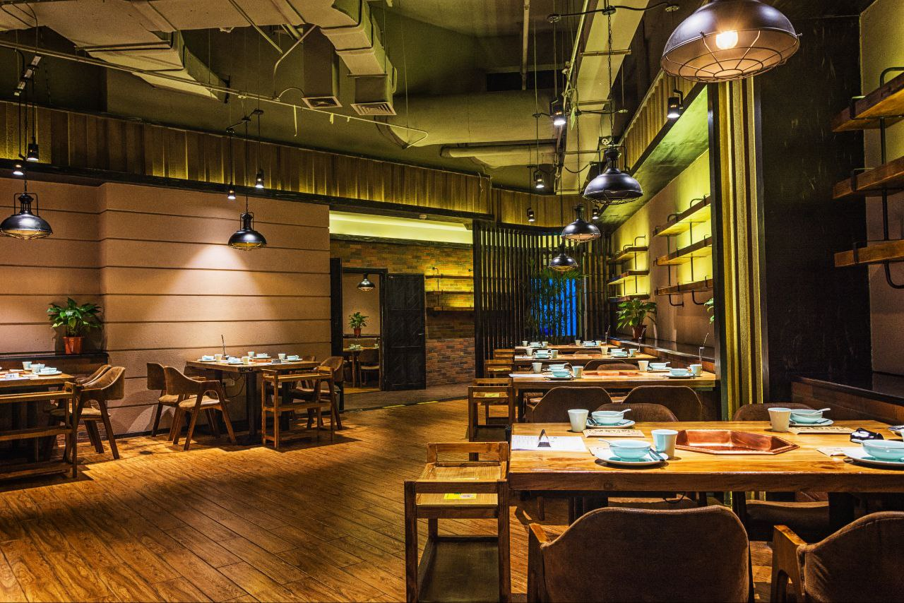
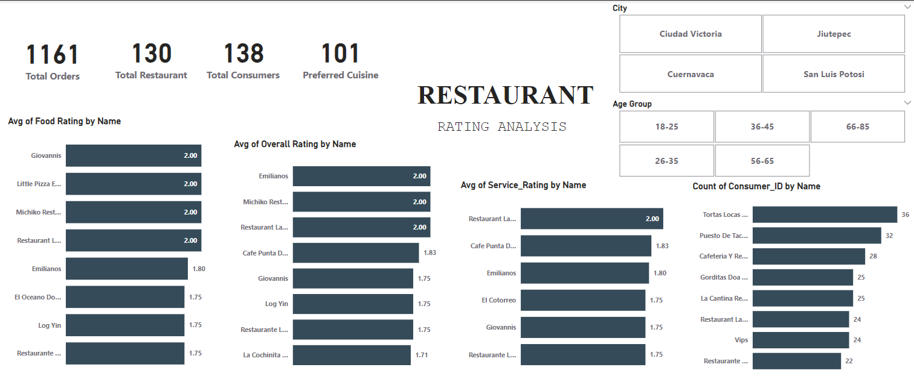
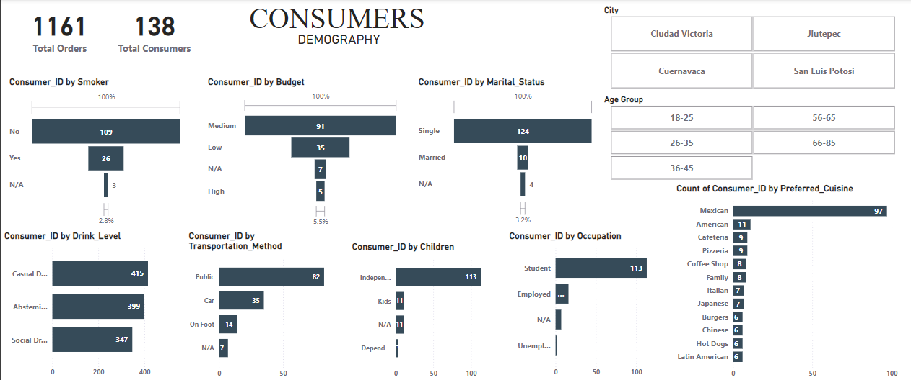

# Restaurant Rating

## Data Source
Capstone project at *Digitaley Drive*

## Introduction
This Power BI project analyzes a Restaurant Rating dataset from a customer survey conducted in Mexico. The goal is to uncover insights into customer preferences, satisfaction, and behavior to help business entrepreneurs and investors make data-driven decisions. By leveraging Power BI's visualization tools, the analysis identifies key trends, highlights factors influencing ratings, and suggests areas for improvement, enabling stakeholders to optimize operations and enhance profitability in the competitive restaurant industry.

## Problem Statement
1. What can you learn from the highest rated restaurant, do consumer preference have an effect on rating?
2. What are the consumer demographics, does this indicate a bias in the data sample?
3. Are there any demand and supply gaps that you can exploit in the market?
4. If you were to invest in a restaurant, which characteristics would you be looking for?

## Modeling 
The automatic derived table relationship were adjusted for proper connection and relationship between tables.

## Concept Execution
The following Power Bi features were incoperated;

- Data sources,
- Data cleaning,
- Power Query,
- Data modeling,
- Caculated Columns and Measures using Dax,
- Data Visualization,
- Filters,
- Dashboard Building and
- Reporting.

## Data Cleaning
Using power query features: column data types were appropriately validated, filtering of columns and using find and replace function to replace empty or null values appropriately for consistency.

## Data Discovery

**Total Orders and Consumers Overview**:

1. *Total Orders*:
1,161 orders were placed, highlighting an active engagement with restaurants.

2. *Total Consumers*:
The data is based on 138 consumers, providing insights into their behaviors and preferences.

**Consumer Demographics**:

1. *Smoking Habits*:
Most consumers are non-smokers (109 out of 138).

2. *Budget*: 
Consumers predominantly have a medium budget.

3. *Marital Status*: 
A large majority (124 out of 138) are single, with a small percentage being married or unreported.

4. *Drinking Habits*: 
Preferences are balanced among casual drinkers, abstemious consumers, and social drinkers, though casual drinkers slightly dominate.

5. *Children*: 
Most consumers (113) are independent without children, while a small fraction is dependent or has kids.

6. *Occupation*:
Consumers are primarily students (16) or employed (11), indicating a youthful and working-class demographic.

## Visualization

The report comprises of 2 pages:

- Ratings overview

- Consumer Demographics.

## Conclusion

The dashboards highlight the need to align with consumer preferences by offering popular cuisines like Mexican with high food and service standards, while catering to the youthful, independent demographic through affordable and accessible options; additionally, diversifying cuisine and drink offerings presents a valuable opportunity to fill market gaps.

## Recommendation

**What can you learn from the highest-rated restaurants? Do consumer preferences have an effect on ratings?**

*Food rating*:
The highest-rated restaurants, like Giovanni's, Little Pizza Emilio, Michiko Restaurant, and Restaurant Las Mananitad for *FOOD RATING* and *SERVICE RATING* with highest rated Restaurant Las Mananitad, have consistently high food and service ratings (all averaging at 2.0) respectively. This suggests they focus on providing exceptional food quality and service.

Yes consumers preference have influenced on the ratings, People tend to rate restaurants higher when the food matches their favorite types of cuisine, showing how much personal taste influences reviews. 
Preferences for specific cuisines (e.g., Mexican, American) are apparent, as Mexican cuisine dominates consumer choices. Restaurants specializing in these cuisines likely have better chances of obtaining higher ratings. 

**What are the consumer demographics? Does this indicate a bias in the data sample?**

*data reveals*:
Most consumers are single (124 out of 138) and independent with no dependent children (113 out of 138).
Casual drinking and abstemious habits dominate, suggesting a preference for restaurants that accommodate these lifestyles.
Most consumers are non-smokers (109 out of 138).
Consumers are primarily students (16) or employed (11), indicating a youthful and working-class demographic.

Indicates bias, yes.
The data mainly comes from younger people aged 18 to 35, which means older groups, like those over 56, aren't well represented. While the information covers different cities fairly evenly, people's tastes can still vary depending on where they live. This means the results might mostly reflect the preferences of younger, single, and independent individuals, making it harder to apply the findings to a broader population.

**Are there any demand & supply gaps?**

Mexican cuisine is incredibly popular, but there’s room to explore other options like Italian, which might not be as widely available but are still loved.
Most people rely on public transit or cars for transportation, but restaurants could make things easier for customers who prefer to walk. Focusing on urban spots or areas with good pedestrian access could be a great way to attract more foot traffic.
Addressing these gaps could help reach a wider audience and connect with market categories that are not being fully served yet.

**If you were to invest in a restaurant, which characteristics would you be looking for?**

*Based on the dashboard*:
If I were to invest, I’d look for a restaurant that serves popular cuisines like Mexican, prioritizes excellent food and service, and targets younger, independent consumers. At the same time, I’d aim to stand out by offering something unique—like a fresh take on drinks or less common cuisines—to attract untapped markets.
